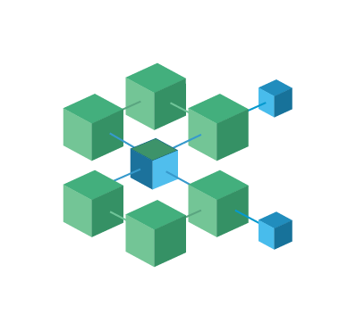

<table border="0">
  <tr>
    <td>
      
    </td>
    <td style="vertical-align: middle; text-align: middle; padding-left: 50px">
      <h1>Provide To Subscribe Model for Koios Token Release</h1>
    </td>
  </tr>
</table>

## Introduction

The utilization of the "Provide to Subscribe" model is a critical component of Koios' strategic token distribution initiative. Its purpose is to stimulate the circulation and liquidity of the Koios token. The advantages and operational mechanics of participating in this model, which incorporates a [SundaeSwap DEX](https://sundae.fi/) based Liquidity Pool, are detailed in this document.

## Overview of the Provide to Subscribe Model

Stake Pool Operators (SPOs) can participate in liquidity provision through the "Provide to Subscribe" model, which is a liquidity-first approach. This facilitates the acquisition of Koios tokens for SPOs and their delegators. The aforementioned framework is crucial for augmenting the functionality and dependability of the Koios token in the context of decentralized finance.

## Mechanism

- **Liquidity Provision**: On [SundaeSwap DEX](https://sundae.fi/) , Stake Pool Operators are offered the opportunity to augment the liquidity of Koios tokens through the deposit of 2,000 ADA and an equivalent quantity of Koios tokens into a designated liquidity pool.
- **Automated Participation Tracking**: A signup page is not necessary in order to participate in the "Provide to Subscribe" model. In order to validate the participation of pool operators, the Koios team will conduct cross-referencing between the stake addresses supplied by liquidity providers and the stake addresses of the wallets that the pools have pledged. This enables the Koios team to identify participating pools automatically for each epoch.
- **Snapshot and Rewards Distribution**: The team can ascertain and validate responsibility for claiming rewards via the [DripDropz](https://dripdropz.io/) platform by capturing a snapshot of the relevant pool delegators at each epoch.
- **Duration and Limits**: The initiative shall persist until the distribution of three million Koios tokens is completed or until it reaches the end of one year (from June 1, 2024 to June 1, 2025), whichever occurs first.

## Benefits

- **Accessibility for Delegators**: The provision of complimentary Koios tokens to delegators via the [DripDropz](https://dripdropz.io/) platform serves to stimulate increased investment and engagement within the Koios ecosystem.
- **Incentives for SPOs**: SPOs benefit not only from potential rewards derived from increased token valuation and trading fees, but also from the stabilization of the token's market presence, which is achieved through their contribution to the liquidity pool.
- **Enhanced Token Utility**: By ensuring that Koios tokens are readily available for immediate use within the ecosystem, the liquidity provided by this model increases the token's overall utility and demand.

## Strategic Importance

The "Provide to Subscribe" model holds significant importance during the preliminary stages of the Koios token launch. By securing significant liquidity in advance, Koios guarantees the token's seamless integration into the decentralized finance environment of the Cardano blockchain. This approach facilitates the expansion of the Koios platform in a sustainable manner, thereby ensuring the token's long-term viability and prosperity.

## Conclusion

Establishing an active and resilient marketplace for the Koios token is the initial objective of the "Provide to Subscribe" model. Ensuring that the token is not only distributed equitably but also bolstered by a robust liquidity backbone is consistent with the overarching objectives of Koios tokenomics. A fundamental component of the Koios token release strategy, this model encourages active engagement from the community, specifically the Stake Pool Operators and their delegators.

To maximize the potential benefits for both individual participants and the Koios ecosystem as a whole, stakeholders are encouraged to firmly review and engage with this model.
