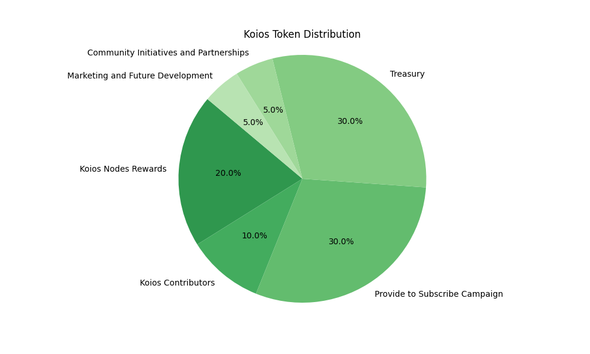

<table border="0">
  <tr>
    <td>
      
    </td>
    <td style="vertical-align: middle; text-align: middle; padding-left: 250px">
      <h1>Koios Tokenomics</h1>
    </td>
  </tr>
</table>

## Introduction

Koios, a novel decentralized API platform built upon the resilient Cardano blockchain, unveiled "Koios," its proprietary utility token. By providing rewards for crucial node contributions and enabling users to access a wide array of data and services, this token has been carefully designed to optimize transactions within the Koios ecosystem.

In order to promote the widespread implementation of Koios, a strategic incentive system has been developed for both Full and Lite nodes. The operation of this mechanism is determined by the quantity of requests that each node processes, which is closely monitored through the API Request Load Balancer statistics.

At the end of each epoch, these critical statistics are collected from the monitoring layer and securely appended to the Cardano blockchain via transaction metadata submission. Following this, the rewards are determined by dividing the predetermined epoch pot proportionally among the nodes that participated actively in the Koios cluster throughout that epoch.

The aforementioned method of reward allocation fulfills two objectives: it incentivizes node operators to sustain active involvement in the Koios cluster, and it cultivates an ecosystem that is both competitive and robust, both of which are vital for the development and stability of the decentralized infrastructure.

In light of the Koios token's potential to facilitate payments for API services and serve as a reward for nodes, we delineate the key principles of our tokenomics framework:

* **_Utility_**: The Koios token is a primary payment method within our API service ecosystem, ensuring fluid transactions and interactions.
* **_Incentive Mechanism_**: Nodes are rewarded with Koios tokens based on their service provision, promoting active participation and ensuring the infrastructure's robustness.
* **_Token Supply_**: A clear set of rules and mechanisms governs the total supply and minting process of Koios tokens, ensuring a transparent and predictable economy.
* **_Token Distribution_**: Strategic allocation of Koios tokens focuses on the ecosystem's growth and sustainability, supporting development, marketing, community incentives, and other key initiatives.
* **_Governance_**: Koios token holders will also have governance rights, influencing the platform's direction and evolution.

**_Core Features of the Reward System_**:

**_Clarity_**: Koios implements a distinctive incentive system for Full and Lite nodes, which is determined by the quantity of requests processed. This is determined by employing accurate Koios Network metrics.

**_Feasibility_**: The reward system is designed for scalability and adaptability, accommodating the network's growth without compromising efficiency.

 This strategy ensures that the nodes, as the backbone of the Koios ecosystem, are adequately compensated for their critical role in maintaining and expanding the network. By balancing immediate rewards with long-term growth incentives, Koios positions itself as a forward-thinking and sustainable platform in the decentralized API landscape.

## _Utility Token Advantages:_

* **_Justification_**: "Koios" serves as a catalyst for platform engagement. Drawing from successful case studies, this utility token model is poised to drive demand and increase intrinsic value.
* **_Regulatory Compliance_**: The tokenomics model of Koios has been meticulously crafted with the best effort to ensure regulatory compliance, aligning it with applicable legal standards and highlighting its classification as a utility token.

## **Koios Token Distribution**

* **_Koios Nodes Rewards (20%)_**: To reward Koios nodes that support and join the decentralised network. These will begin distributing in the second year following the token release.
* **_Koios Contributors (10%)_**: Rewarding community contributions, fostering a sense of shared ownership.
* **_Provide To Subscribe (30%)_**: Funding the project's growth, ensuring equitable distribution and engaging the community from inception.
* **_Treasury (30%)_**: A strategic reserve for governance, funding new developments, and ensuring resilience.
* **_Community Initiatives and Partnerships (5%)_**: Fueling collaborations and community-driven projects within the Cardano ecosystem.
**_Marketing and Future Development (5%)_**: Dedicated to expanding reach and evolving the platform.

    

This chart represents the allocation of the total 10 million Koios tokens among various stakeholders. The different shades of green indicate the proportion of tokens allocated to each segment, including node rewards, contributors, the Provide to Subscribe distribution, treasury, community initiatives, and marketing.

## _Tokenomics Basic Principles:_

* **_Token Supply and Distribution_**: A total of 10 million "Koios" tokens will be minted, with a distribution strategy crafted to bolster the ecosystem's sustainability (illustrated in accompanying graphs).
* **_Governance_**: Token holders are integral to governance, with a voting system that ensures their voices steer platform evolution.

## _Koios Token Vesting Model_

| Category                             | Year 1   | Year 2   | Year 3   | Year 4   | Year 5   | Total Distributed |
|--------------------------------------|----------|----------|----------|----------|----------|-------------------|
| Liquidity Pool (7%)                  | 700k        | 0 | 0 | 0 | 0 | **700k**         |
| Nodes Rewards (20%)                  | 0        | 500k | 500k | 500k | 500k | **2Mil**         |
| Koios Contributors (10%)             | 200k | 200k | 200k | 200k | 200k | **1Mil**         |
| Provide To Subscribe (30%)           | 3Mil| 0        | 0        | 0        | 0        | **3Mil**         |
| Community Initiatives and Partnerships (5%) | 100k | 100k | 100k | 100k | 100k | **500k**           |
| Marketing and Future Development (5%)| 100k | 100k | 100k | 100k | 100k | **500k**           |
| **Total Distributed per Year**       | 4.1Mil| 900k | 900k | 900k | 900k | **_7.7Mil_**         |

#### _Note:_

For a detailed understanding of the operational mechanics behind the "Provide To Subscribe" Campaign, please consult the [Provide To Subscribe Campaign](Provide_To_Subscribe.md) document. Any tokens not allocated through this Campaign will be redirected to the treasury.

The treasury's allocation, totaling 3 million tokens, does not require a vesting period and is reserved specifically for targeted proposals. These allocations will be determined using Koios governance's structured voting processes, ensuring alignment with our strategic objectives and community input.

An additional 2 million tokens to reward koios nodes are scheduled to be distributed commencing in the second year, with an annual disbursement of 500k tokens. This strategic incentive is intended to reward nodes for their critical role in maintaining and advancing the decentralization of the Koios network, reinforcing the core principles of our tokenomics framework. This approach not only strengthens the network, but also demonstrates our commitment to fair and transparent token distribution.

## **Reward Calculation for Nodes**

Consistent with Koios' dedication to cultivating a resilient and collaborative network, an all-encompassing approach to token distribution has been devised to motivate and compensate the crucial nodes composing the Koios ecosystem.

### Revenue Allocation from Advanced API Access

This strategy is predicated on a significant proportion of the revenue generated from the sale of advanced (non-free) API access. More precisely, 90% of the tokens acquired through these transactions will be re-distributed among the nodes that comprise the Koios network. The allocation is determined in a rigorous manner by counting the number of requests fulfilled by each node, thereby guaranteeing a fair and proportional distribution of the pot across all active nodes.

The Koios treasury receives the remaining 10% of revenue generated from orders for advanced API access. Supporting future development and governance initiatives, this allocation is vital for the platform's strategic growth and sustainable financial management.

### Additional Contributions to Support Node Incentives

To further support the network’s development and to motivate node operators, particularly in the formative years of the network, the Koios treasury will contribute an additional 500,000 Koios tokens to the node reward pool each epoch. This enhanced incentive will begin from the second year (starting June 1, 2025) and will continue annually for the subsequent four years.

By strategically redistributing resources, this not only provides a direct incentive for contributions from nodes but also fosters an ongoing cycle of investment and expansion within the ecosystem. The operational excellence and sustainability of the decentralized Koios network are supported by this strategy, which strikes a balance between short-term rewards and long-term growth incentives.
